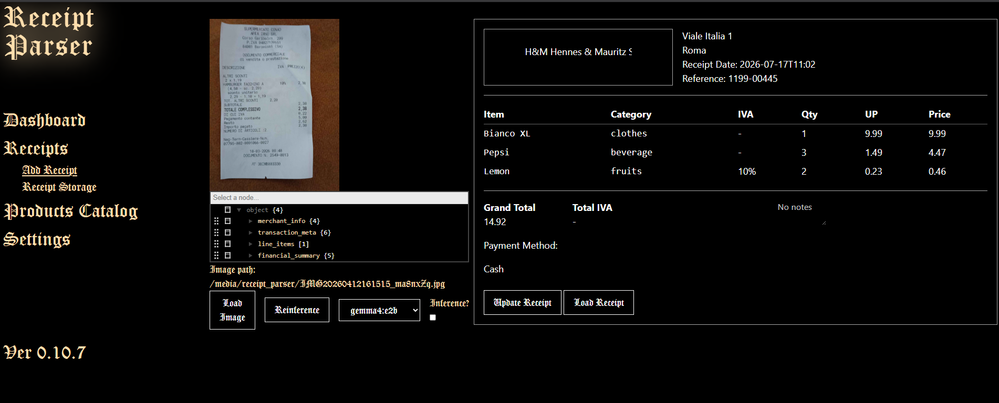
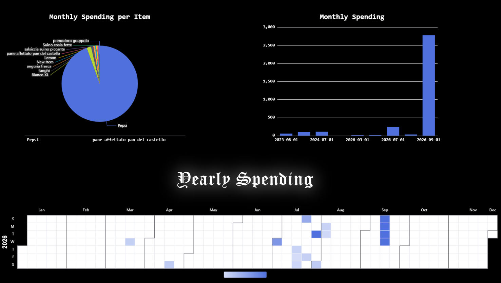

Receipt Parser allows users to parse their receipt using **AI**

<!--  -->

# Navigation
1. <a href="#current-features">Current Features </a>
2. <a href="#how-it-looks">How it looks? </a>
3. <a href="#set-up-windows">Set up (Windows) </a>
4. <a href="#set-up-linux">Set up (Linux) </a>

# How it looks?
<h3>Add Receipt Page:</h3>

<h3>Dashboard Page:</h3>

# Current Features
<h3 id="current-features">Currently implemented features are:</h3>

* Receipt upload
* Receipt parsing using locally running agent (mostly used gemma4:e2b and gemma4:e4b)
* Form allowing user to view and modify model's inference result
* A calendar with a heat map showing in which days there are receipts, total spending that day and ability to click on a specific day to see all related receipts
* Per week/month/year total spending chart, divided in categories
  
# Set up (Windows)
<h3 id="set-up-windows">Set up on a windows machine consists of following steps:</h3>

  1. Install and correctly set up python 3.11 and pip
  2. Install docker desktop
  3. Clone this repository
  4. In project's root run:
     
     * `$ docker compose up`
     * `$ py manage.py migrate`
     * `$ py manage.py runserver`

# Set up (Linux)
<h3 id="set-up-linux">Set up (Linux):</h3>

1. Install and correctly set up docker following steps according to your linux distro
2. Clone this repository
3. Stop everything that is using port 80 (most probably it's apache2 which can be stopped with `$ systemctl stop apache2`)
4. run `$ docker compose up`
